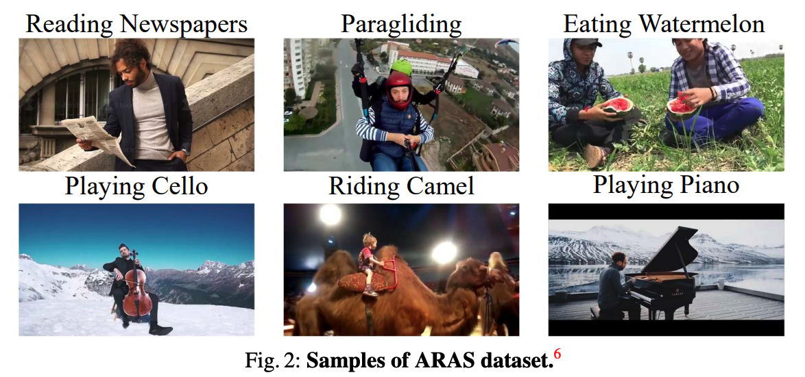

# Action with RAre Scene (ARAS)

<div align="center">
  <br>
</div>

**A**ction with **RA**re **S**cene is a small scale dataset collected from Youtube. By definition, it includes video clips of human actions (those action categories fall into Kinetics-400 action classes) with rare scenes or backgrounds. To collect this dataset, we begin with action labels in Kinetics and consider some rare scenes. The combinations of actions and rare scenes are used as queries to obtain web videos from YouTube. We manually examine the web videos and obtain around ten videos for each class in 104 Kinetics classes, denoted as Action with RAre Scenes (ARAS). In our paper [Mitigating Representation Bias in Action Recognition: Algorithms and Benchmarks](https://arxiv.org/pdf/2209.09393.pdf), we use ARAS to simulate the out-of-distribution testing for scene-debiasing evaluation.

Update (2024-11-05): The dataset files are moved to Google Drive. Here are the new download links:

- Annotations: https://drive.google.com/file/d/1AdSrll9S_f47LUMchDZuzWBn419ndZ2C/view?usp=sharing
- CLIP Files: https://drive.google.com/file/d/1GwjfhpRAq-o9wPBntFLBuIL52eExeG5T/view?usp=sharing
- Raw Video Files: https://drive.google.com/file/d/1vX6kswg1EjzB4P-OV0kGEJ6JTtbiM7WV/view?usp=sharing


In `annotations`, we provide some annotations files for you to easily use this dataset:

- `aras_clip_info.txt`: The trimming information of each clip, each line has 3 items: `clip_name`, `start_index (second)`, `end_index (second)`
- `aras_test_balance.txt`: The file list of ARAS-104, a balanced test set we used in the paper, it includes 1038 video clips from 920 untrimmed videos. The test set covers 104 Kinetics-400 actions. 
- `k400_actions.txt`: A name list of 400 Kinetics actions, sorted by category index. 

Please cite this work if you find ARAS useful to your research project:

```BibTex
@misc{https://doi.org/10.48550/arxiv.2209.09393,
  doi = {10.48550/ARXIV.2209.09393},
  url = {https://arxiv.org/abs/2209.09393},
  author = {Duan, Haodong and Zhao, Yue and Chen, Kai and Xiong, Yuanjun and Lin, Dahua},
  keywords = {Computer Vision and Pattern Recognition (cs.CV), FOS: Computer and information sciences, FOS: Computer and information sciences},
  title = {Mitigating Representation Bias in Action Recognition: Algorithms and Benchmarks},
  publisher = {arXiv},
  year = {2022},
  copyright = {arXiv.org perpetual, non-exclusive license}
}
```
